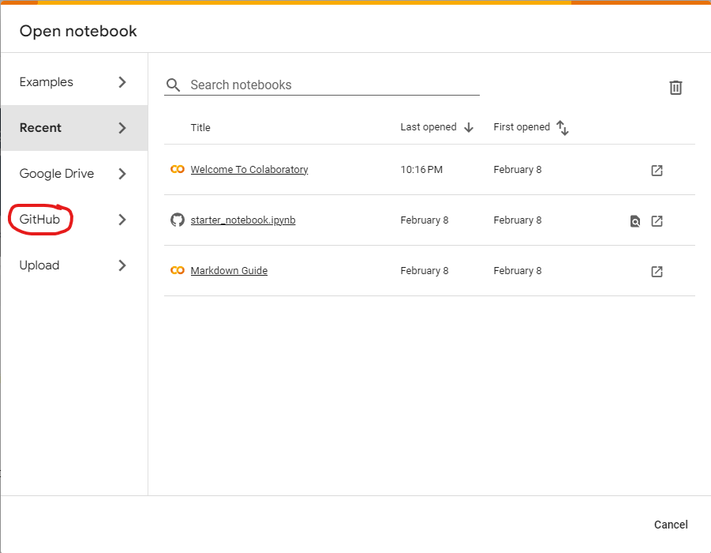

# Getting Started With Google Colaboratory (Google Colab)

First, go to the Google Colaboratory (aka Google Colab) [site](https://colab.research.google.com/). Once you are there, click on the blue “Sign In’ button at the top right corner of the page.

Sign in with your Gmail address. Once signed in, you may get a pop-up that says “Open Notebook” as the title. If not, or if you may have accidentally misclicked somewhere outside the pop-up, fret not! Click on “File” by the top left corner, then click on “Open Notebook” from the dropdown:

You should get the pop-up as shown below. Once you’re there, click on “GitHub” from the list on the left:

You might get a pop-up window that asks you whether you want GitHub to have access to your Google account. Whether you’d like to allow access or not is up to you (it may be useful to allow access now if you plan on working on data science/machine learning projects through Google Colab in 
the future). Next, copy and paste this link into the search bar where it asks to enter a GitHub URL: https://github.com/tritonhacks/Tritonhack2024-ML-Starter-Kit/tree/main

The screenshot above only displays the file for the starter notebook. This is because the screenshot was taken at the time the starter kit was being developed–there may currently be other files. By copying and pasting a valid GitHub URL for a repository, Google Colab will look for files 
within the repository that are Jupyter Notebooks (files ending with the extension `.ipynb`). For now, open the starter notebook by clicking on the file circled in red. You should now see this:

Once you’re here, you’re ready to start making some edits to your Jupyter Notebook file! 
