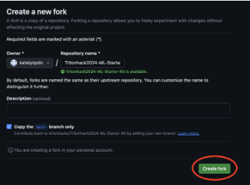

# 
 Git, (Mini)conda, Python Jupyter Notebook

## Table of Contents
1. [What is Git/GitHub?](#git)
2. [What is Conda?](#conda)
3. [Installing Miniconda for Windows](#windows)
4. [Installing Miniconda for Mac](#mac)
5. [What is a Notebook?](#notebook)
6. 

## What is Git/GitHub? 

*Git* is a version control system: it is essentially a tool that keeps track of file history. A **repository**, or a repo, is a place where files and their histories are stored.

*Github* is a Git cloud service where you can access repositories.

### Why use Git?

Git helps developers collaborate on code. It keeps a record of all the changes made so we can go back in history if there is faulty code. Each person can work on the code in their own separate *branch*, then commit any changes they make.

### Install Git

To check whether you have Git installed, open a Terminal window and type `git --version`. If it is installed, you should have at least version 2.x. If it is not installed, go to the [downloads page](https://git-scm.com/downloads) to install it.

### Forking a Repository

Forking a repository copies the source code to a new repository, where you can make your own separate changes. To fork, go to the repository [website](https://github.com/tritonhacks/Tritonhack2024-ML-Starter-Kit) and click Fork on the top right. 

Then, click Create Fork.

### Cloning a Repository

Now that you have a fork of the repository, you can now save the code to your local computer by cloning it. 
1. To clone a repository, first go to your forked repository and copy the URL address. It should look something like: `https://github.com/MY_USERNAME/Tritonhack2024-ML-Starter-Kit`
2. Open a Terminal window and type `git clone`, then copy and paste your URL. Hit enter.
3. Success! It should say, `Cloning into…` and `Unpacking into…`

### Additional Information

#### Files: .gitignore

Sometimes we want to tell Git to ignore certain files in our project. For example, we may have temporary or log files that we don’t want to commit every time. In this case, our repository has a `.gitignore` file that will list what files to ignore. 

For example, having `*.log` in `.gitignore` will tell Git to ignore any files ending in `.log`. Adding `temp/` will tell Git to ignore all files in the `temp` folder. 

## What is Conda? 

Conda is a package management system that keeps packages (NumPy, pandas, etc.) compatible with your projects. It is incredibly useful for people working in data science and machine learning because it allows them to use different versions of the same package across different projects. 

The software you will download, Miniconda, will include Conda, Python, and some functional packages.

## Installing Miniconda for Windows 

First, go to this [link](https://conda.io/projects/conda/en/latest/user-guide/install/windows.html). Once you’re there, click on “Miniconda Installer for Windows” as shown below:

This should take you to a link with instructions to install Miniconda. Scroll down to the very bottom until you see this:

Copy the text circled in red using Ctrl+C. Next, press the Windows key and search for “Command Prompt”. Open it up, and paste the text into the terminal. It should look like this:

Wait until a line pops up right below the last line that, after the name of your current working directory, reads: “del miniconda.exe”. Press Enter, then close the Command Prompt. Next, press the Windows key and search for “Anaconda Prompt”. Once you have found it, open it. It should look like this:

If you’ve made it this far, congratulations! You have finished setting up Miniconda on your WIndows device. Although there doesn’t look like much going on here, you can type “help”, then press Enter to discover a list of commands for Conda. 

## Installing Miniconda for Mac 

1. First, go to the Miniconda website at this [link](https://docs.conda.io/projects/miniconda/en/latest/miniconda-install.html). 
2. Next, click on “**macOS graphical installer**”
3. Click “**Download the installer,**” circled below.

4. Under “**Latest Miniconda installer links,**” click on one of the two .pkg files, depending on whether you have a M1/M2 Mac or Intel Mac (If you don’t know, click the Apple logo on the top left and click “About This Mac”).

5. Once the .pkg file is done downloading, double click on the file in your Downloads folder.
6. Answer the prompts on the screen to let the installer download Miniconda.
7. Success! After it is done installing, it should say “Thank you for installing Miniconda.”
8. Open a new Terminal window and run `conda list`. If you successfully installed Miniconda, a list of packages should appear. You’re all done!

## What is a Notebook? 

A notebook is an interactive computational environment in which users can execute a particular piece of code and observe the output and make changes to the code to drive it to the desired output or explore more. Jupyter notebooks are heavily used for data exploration purposes as it involves a lot of reiterations. It is also used in other data science workflows such as machine learning experimentations and modeling. Data Science requires several trials and failure to find the “sweet spot” for the model and rerunning the entire program will be time-consuming and tiring. Using a notebook, data scientists can reduce their time and cost efficiently. It can also be used for documenting code samples. A Jupyter notebook has independent executable code cells that users can run in any order.

In this project, you will be introduced to Python Jupyter Notebook. It is totally up to you guys to use either Jupyter Server or just the given IDE such as Visual Studio Code.

